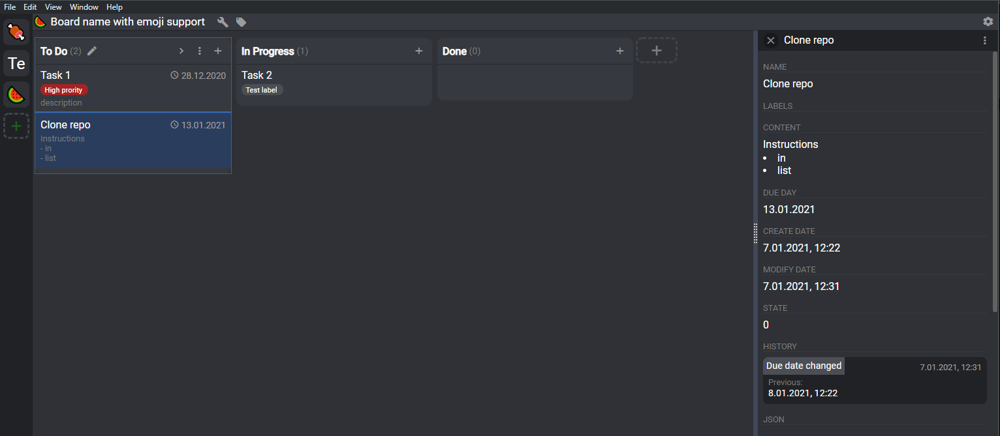

# SKanban

Offline kanban tool. Based on electron 10, angular 10 and sqlite3




##### Download: [Last release link](https://github.com/Sheryv/SKanban/releases/latest)

### Link parsing in task content
Examples of code to link parsing that can be provided in settings screen
```regexp
CC-\d+;https://stackoverflow.com/
DD-\d+;https://google.com/$&/zz
```

-----
Template based on https://github.com/dalenguyen/todo-app-electron-angular


-----
License: GNU General Public License v3.0
